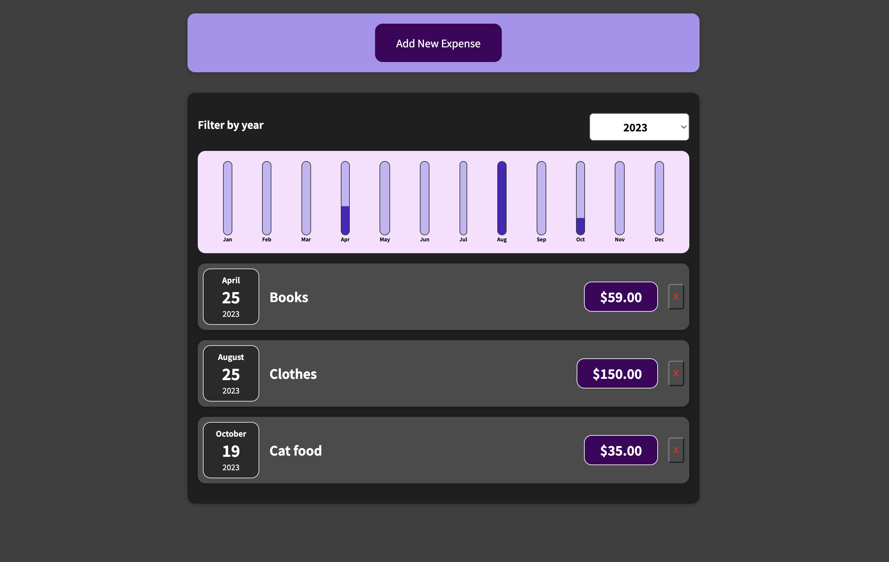

# Expenses manager

This is my first web application created with React. Expense Manager is a simple web application that allows you to manage your expenses and view them in a convenient way, complete with interactive charts.

You can check out a live demo of the app at https://zoromari.github.io/expenses-manager/

## Getting Started

Follow these steps to set up the project on your local machine.

Before you begin, ensure you have the following software installed:

- Node.js and npm

### Installation

1. Clone this repository to your local machine:

2. Navigate to the project directory:
cd expense-manager

3. Install project dependencies:
npm install

Running the App
To start the Expense Manager app on your local development environment, run the following command:
npm start

The app will launch at http://localhost:3000.